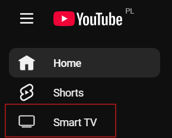
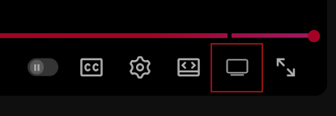

<p align="center">
  
</p>

<h1 align="center">YouTube Smart TV Browser Extension</h1>

<p align="center">
  <a href="LICENSE"></a>
  <a href="https://github.com/pxbunny/yt-smart-tv/actions/workflows/ci.yml"></a>
</p>

A lightweight browser extension that adds an **Open in TV mode** control to YouTube. It integrates with the standard YouTube layout by adding:

- a button in the left navigation menu
- a button next to the fullscreen control on the player

so you can quickly switch to the **YouTube TV** UI and control playback from your phone.

<table align="center">
  <tr>
    <td valign="middle" align="center">
      
    </td>
    <td valign="middle" align="center">
      
    </td>
  </tr>
</table>

## ✨ Features

- One-click switch to **YouTube TV** (`https://www.youtube.com/tv`).
- Buttons integrated into the YouTube interface (sidebar + player controls).
- Player button resumes the current video at the same timestamp in TV mode.
- Works entirely client-side; no data leaves your browser.

<a id="compatibility"></a>

## ✅ Compatibility

- Google Chrome
- Mozilla Firefox
- Microsoft Edge, Brave, Vivaldi, and other Chromium-based browsers

## 📦 Installation (from source)

### Requirements

- **Node.js** 20+
- A compatible browser (see [Compatibility](#compatibility))

### Steps

1. Clone the repository:
   ```bash
   git clone https://github.com/pxbunny/yt-smart-tv.git
   cd yt-smart-tv
   ```

2. Install dependencies:
   ```bash
   npm install
   ```

3. Build the extension:
   ```bash
   npm run build
   ```
   This creates production builds in:
   - Chromium: `dist/chrome-mv3/`
   - Firefox: `dist/firefox-mv2/`

4. Load unpacked (Chromium):
   - Open [`chrome://extensions`](chrome://extensions).
   - Enable **Developer mode** (top-right).
   - Click **Load unpacked** and select the `dist/chrome-mv3/` folder.

5. Load temporary add-on (Firefox):
   - Open [`about:debugging#/runtime/this-firefox`](about:debugging#/runtime/this-firefox).
   - Click **Load Temporary Add-on...**
   - Select `dist/firefox-mv2/manifest.json`.

## ▶️ Usage

1. Open a regular YouTube page.
2. Click **Smart TV** from the left menu or the TV icon near the fullscreen button.
3. YouTube opens in TV mode in a new window. Press `Esc` inside TV mode to leave.

> Note: `Esc` closes the Smart TV window only when YouTube shows the exit overlay (the one with buttons like “Exit” / “Back”). In some cases (especially when you’re not logged in), YouTube may show a sign-in screen instead and `Esc` won’t work. If that happens, exit fullscreen manually and close the Smart TV window yourself.

## 📱 Link your phone with a TV code

You can pair your phone with YouTube running in TV mode and use it as a remote control.

1. Open YouTube TV mode.
2. Go to **Settings > Watch on TV > Enter TV code**.
3. Follow the on-screen steps to finish pairing.

> After pairing, you can queue videos, control playback/volume, and browse from your phone while the TV UI plays on your computer.

## 🔒 Privacy & permissions

- The extension does not collect, store, or transmit personal data.
- All functionality runs locally in your browser.
- Uses minimal permissions required to inject the UI controls and apply a User-Agent override for `youtube.com/tv` (via `declarativeNetRequest`).
